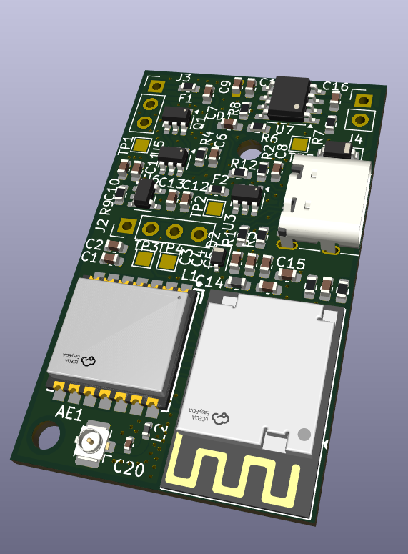
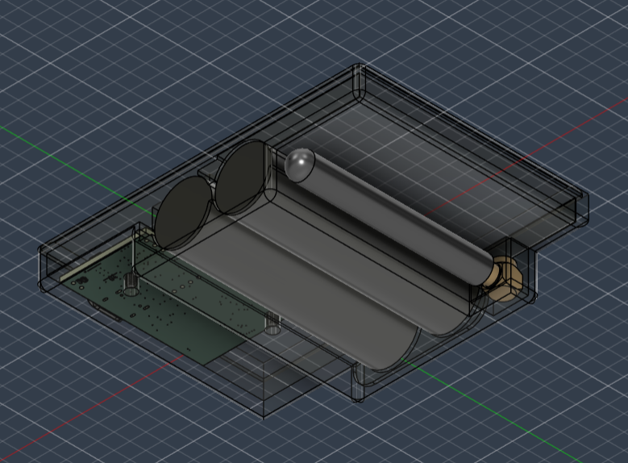
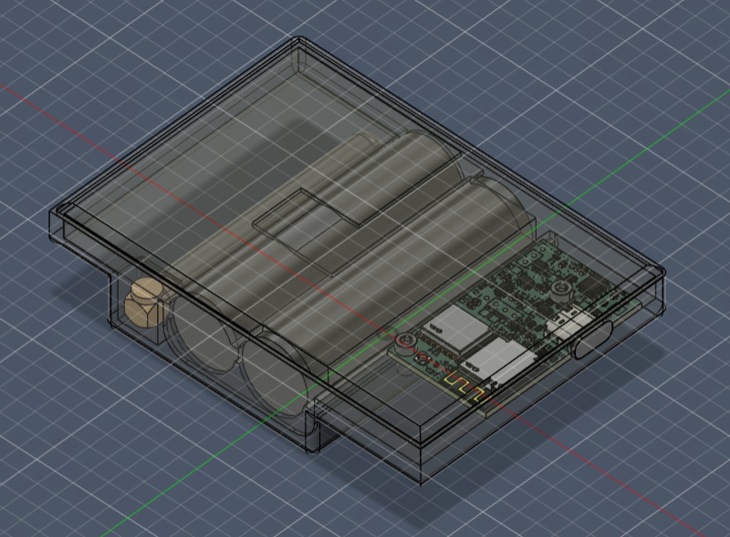
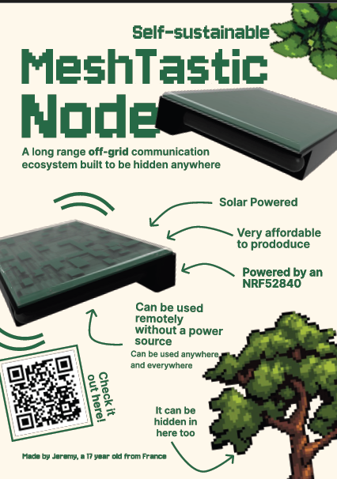

# fantastic-node
A meshtastic node designed to be self sufficient (solar powered) and small/unnoticeable enough to be planted in urban spaces.

I think that mestastic is a great project aiming at making an offgrid network of devices allowing for communication but as part of how it operates, it is limited by the cost and ease of implementing these community ran nodes transmitting packets across a city for instance. 

In this repo, you will find a pcb meant to be affordable, with a 3d printable case and easily sourcable parts.

## PCB!

## Full CAD assembly

# BOM 
| Name     | Qty     | Price  | Link   | Note |
| -------- | ------- | ------ | ------ | ----- |
| Components | 1     | 20usd  | /hardware/bom_export_mesh.xls |
| PCB      | 1x5pcs  | 5usd | https://jlcpcb.com/ | |
|3d printed parts | 2 | 0.1usd | N/A |  Print it yourself|
| total         |         | usd |  |shipping included

# Assembly

1. Assemble the pcb put all components together and soldere them using the schematic 
2. Print the case+parts and glue the solar pannel in place then place all heat inserts in holes
3. Build the firmware following [meshtastic instructions](https://meshtastic.org/docs/development/firmware/build/) using files in /firmware/* and flash with usb !
4. Put the board and wire antenna plug connect battery to terminals to test out if working and then glue the battery and screw everything together. Use the f3d file to help with assembly :3
(will add more details and pics once i make it)

# ZINEE 
